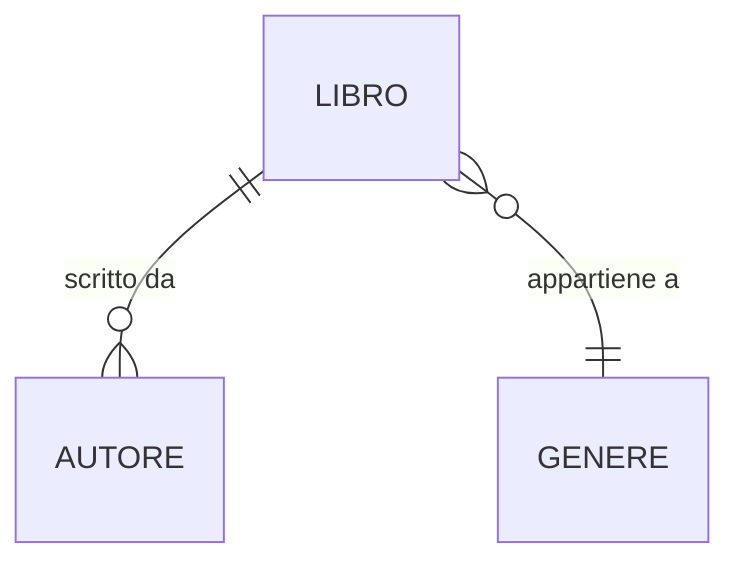

# Esercitazione per gruppi
## Repo
`gen-jaita138-springboot-hibernate-gruppi-1`
## Gruppi
### Gruppo 1  
1. ==Marco Abbondanza==
2. Fioravante Bifulco  
3. ~~Daniel Di Giacomo~~  
4. Claudia Iuliano  
### Gruppo 2  
5. Dominic Bejan Piser  
6. Leonardo Boscolo Boscoletto  
7. Giovanni Di Guida  
8. Luigi Matrone  
### Gruppo 3  
9. Simone Canu  
10. Catalin Ionut Ciobanu  
11. Luca Gallotta  
12. Eleonora Monterisi  
### Gruppo 4  
13. Riccardo Di Niccolo  
14. Nicolo' Giuliani  
15. Alexander Gabriel Ibarra Gomez  
16. Alisse Arianna Rodriguez Valenza  
### Gruppo 5  
17. Jose Gabriel Teran Condori  
18. Angela Spierto  
19. Pierpaolo Valentini  
20. Domenico Stornaiuolo  
## Database

- per ogni **Libro** è associato a un solo **Autore** 
- per ogni **Libro** può essere collegato a uno o più **Generi**
- per ogni **Autore** esistono uno o più **Libri**
- per ogni **Genere** esistono zero o più **Libri**

> [!note] Esempio
> -  Il libro _"Il Signore degli Anelli"_ (Autore: J.R.R. Tolkien) può appartenere ai generi _"Fantasy"_ e _"Avventura"_
> - L'autore _"Agatha Christie"_ ha molti libri, ciascuno con un solo genere (es: _"Giallo"_).
### Descrizione delle tabelle
#### Libro
Ogni libro deve contenere il `titolo`, l'`anno di pubblicazione` e l'`ISBN`.
#### Autore
Ogni autore deve contenere `nome`, `cognome` e `nazionalità`.
#### Genere
Ogni genere è definito unicamente dal `nome`.

## CLI Menu
Il menu a riga di comando si occupa di interagire con l'utente e definire le varie operazioni possibili sulla base dati. Le possibili operazioni svolte dall'utente devono includere:

**LETTURA**
- lettura di tutti i libri (senza relazioni)
- lettura di tutti i libri con autore (senza generi)
- lettura di tutti i libri con autore e generi
- lettura di tutti gli autori (senza relazioni)
- lettura di tutti i generi (senza relazioni)

**SCRITTURA**
- aggiungere nuovo autore (senza definire libri)
- aggiungere nuovo genere (senza definire libri)
- aggiungere nuovo libro con relativi autore e generi

**RICERCA**
- lettura di tutti i libri con titolo che inizia per `p` (case insensitive)
- lettura di tutti i libri prodotti tra il **2000** e il **2020**
- ricerca del libro con `ISBN` uguale a **978-3-16-148410-0**

**BONUS**
- lettura di tutti gli autori con relativi libri 
- lettura di tutti i generi con relativi libri

## TODO
Dopo essersi suddivisi in gruppi, creare un **unico repository** condiviso, dove verranno incluse tutte le modifiche. Si consiglia di definire in maniera **precisa e completa il database**, per poi suddividersi i compiti in modo da **lavorare parallelamente**.